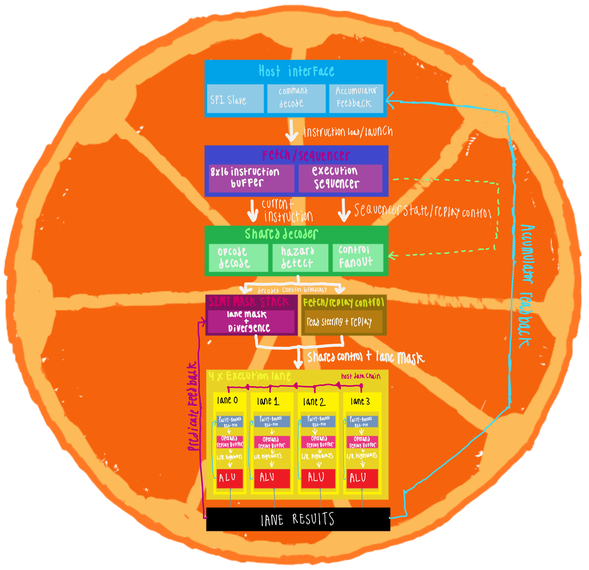
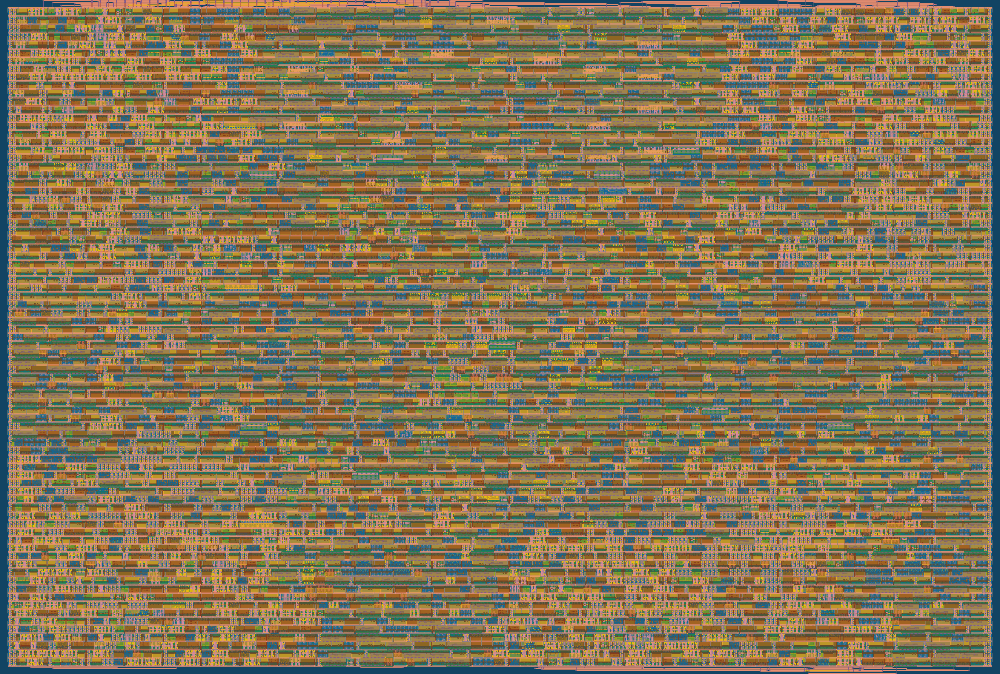

   

https://github.com/user-attachments/assets/2a935765-3c63-42a5-b818-157d14847543

## What do you have, Clementine?

- 4 lanes, int8 datapath, 16-bit accumulator per lane
- Custom 16-bit fixed-width ISA, 16 opcodes
- Hardware branch divergence: depth-2 mask stack with automatic reconvergence
- 8-instruction stored-program buffer, reruns without reloading
- Per-lane host data staging over SPI (MOV_HOST)
- SPI interface (Mode 0), command on sideband pins

- **How to Use:**
  - [Assembler + Loader](bringup/host/README.md)
  - [DOOM Setup](bringup/demo/doom/README.md)
- **Design Docs:**
  - [Documentation](docs/info.md)
- **Pre-Silicon Validation/Bringup:**
  - [Bringup and Validation](bringup/README.md)

## ISA

16-bit fixed-width instructions, 16 opcodes.

### Fields

| field | bits | used by |
|---|---|---|
| opcode | [15:12] | all |
| rd | [11:9] | ADD, SUB, AND, OR, XOR, SHL/SHR, LDI, MOV, MVAC |
| rs | [8:6] | ADD, SUB, AND, OR, XOR, SHL/SHR, MAC, CMP, MOV, LDAC |
| rt | [5:3] | ADD, SUB, AND, OR, XOR, SHL/SHR, MAC, CMP |
| imm8 | [8:1] | LDI only, full 8-bit value |
| cond | [11:10] | CMP only. 00 LT, 01 GT, 10 LE, 11 GE |
| sel | [3] | MVAC and LDAC. 0 low byte, 1 high byte |
| subop | [4] | opcode 1110 only. 0 IFP, 1 ELSE |
| dir | [0] | SHL/SHR only. 0 left, 1 right logical |
| target | [3:0] | opcode 1110 only. Reconvergence address |

### Opcodes

| opcode | mnemonic | operation |
|---|---|---|
| 0000 | NOP | no operation |
| 0001 | ADD | rd = rs + rt |
| 0010 | SUB | rd = rs - rt |
| 0011 | AND | rd = rs & rt |
| 0100 | OR | rd = rs \| rt |
| 0101 | XOR | rd = rs ^ rt |
| 0110 | SHL / SHR | rd = rs shifted by rt[2:0], bit[0] picks direction |
| 0111 | MAC | acc += rs * rt |
| 1000 | CLRACC | acc = 0 |
| 1001 | LDI / MOV_HOST | bit[0]=0: rd = imm8, broadcast to all lanes. bit[0]=1: each lane loads its own staged byte |
| 1010 | MOV / LANEID | bit[0]=0: rd = rs. bit[0]=1: rd = this lane's index |
| 1011 | CMPLT / CMPGT / CMPLE / CMPGE | set per-lane predicate from rs vs rt, cond field picks the test |
| 1100 | MVAC | rd = accumulator half |
| 1101 | LDAC | accumulator half = rs |
| 1110 | IFP / ELSE | divergence control |
| 1111 | HALT | signal done |

Registers are R0-R7. R0 is hardwired to zero and cannot be written.
Operands are signed int8. The accumulator is 16-bit signed.

CMP is one opcode with four mnemonics. The cond field selects less-than,
greater-than, less-or-equal, or greater-or-equal.

SUBREV, CMPREV, SHLREV, SHRREV are internal reversed-highway routing forms of SUB, CMP, SHL, SHR. They fire when rs is odd and rt is even, share the parent opcode, and produce the same logical result.

### Bank-conflict stall

`bank_conflict = uses_both_sources & same_bank_parity`. Fires whenever a two-source instruction has rs and rt of the same parity. No exclusions. Resolved by operand-hold capture/replay, one extra cycle.

### SIMT divergence

Depth-2 mask stack. IFP narrows the mask to true lanes, ELSE reconstructs the parent and pushes RECONVERGE with the ENDIF address. ENDIF is an assembler-resolved address, not an opcode; reconvergence fires when logical_pc equals the top RECONVERGE token's target. MOV_HOST obeys the active mask (a masked-off lane is not written).

## Architecture Diagram

You may need to zoom in, I drew this on my tablet (I dont like diagram software)
## Project Structure

- `src/`: Verilog design files
  - `tt_um_bigmanraffa_clm.v`: Tiny Tapeout top level wrapper, SPI command decode, four lane instances, and per-lane accumulator readback
  - `clm_lane.v`: One SIMT lane, wiring the register file, ALU, and multiplier into a single datapath
  - `clm_fetch_seq.v`: 8-slot stored-program buffer, program counter, bank-conflict replay, and halt reporting
  - `clm_decoder.v`: Two-layer opcode grid, one control wire hot per cycle
  - `clm_regfile.v`: 8 registers split into even/odd banks by address parity, two 4:1 read muxes instead of two 8:1, R0 grounded and reused for LANEID
  - `clm_alu.v`: Adder, shifter, and logic ops, including the reversed-highway routing forms (SUBREV, SHLREV, CMPREV)
  - `clm_mult_bw.v`: Signed 8x8 Baugh-Wooley multiplier, Dadda compressor tree into a ripple-carry adder
  - `clm_fa.v`, `clm_ha.v`: Full and half adder primitives used by the compressor tree
  - `clm_mask_stack.v`: Depth-2 divergence mask stack with automatic reconvergence
  - `clm_spi_host.v`: SPI slave (Mode 0), command held on sideband pins, CS-delimited transactions
  - `config.json`: Tiny Tapeout hardening configuration
- `test/`: Cocotb testbenches
  - `test.py`: 39 cocotb tests, 247 assertions. 29 unit tests drive the real module hierarchy (decoder, lane, fetch sequencer, SPI slave) against architectural golden models, and 10 full-chip tests cover the ISA end to end, SIMT divergence and reconvergence, bank-conflict replay, MOV_HOST staging, SPI framing, and accumulator readback. The hierarchy tests report SKIP under `GATES=yes`, since synthesized gate-level netlists are flattened
  - `tb.v`: Tiny Tapeout cocotb wrapper, instantiates the DUT and dumps waveforms
  - `individual/tb_mult_bw.v`: Exhaustive multiplier bench, all 65,536 signed input pairs, zero mismatches
  - `individual/fpga_bringup_tb.v`: FPGA bring-up bench, PLL lock and frequency, SPI timing from 1 to 5 MHz, and end-to-end kernel execution
- `docs/`: Project documentation
  - `info.md`: Module datasheet, the multiplier and register file designs in detail
  - Diagrams, waveform captures, and hardware photos referenced by the READMEs
- `bringup/`: Pre-silicon validation on a Gowin GW2AR FPGA and an ESP32-S3
  - `README.md`: Validation methodology, breadboard wiring, and the SPI congestion bug writeup
  - `TangNano20K/`: Gowin project, FPGA top-level wrapper, pin/timing constraints, and PLL IP
  - `host/`: Combined assembler + loader (`assembler.c`) and the 39-kernel ISA test suite in `kernels/`, with expected per-lane results
  - `esp32/UART-to-SPI/`: Bridge firmware, unwraps each UART packet onto Clementine's command pins and SPI bus
  - `demo/doom/`: WAD parsers that bake E1M1 geometry, sector heights, a Q0.7 sine table, and HUD graphics into C headers, plus `walk.py`
  - `demo/doom_driver/`: Walks the BSP tree, feeds wall geometry to Clementine, and blits the returned rows to the panel
  - `demo/lcd_test/`: ST7789 panel bring-up sketch

## GDS 2D Preview

 
