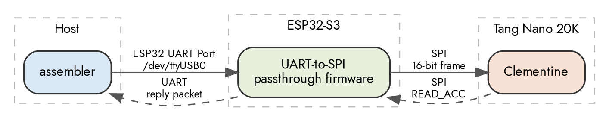
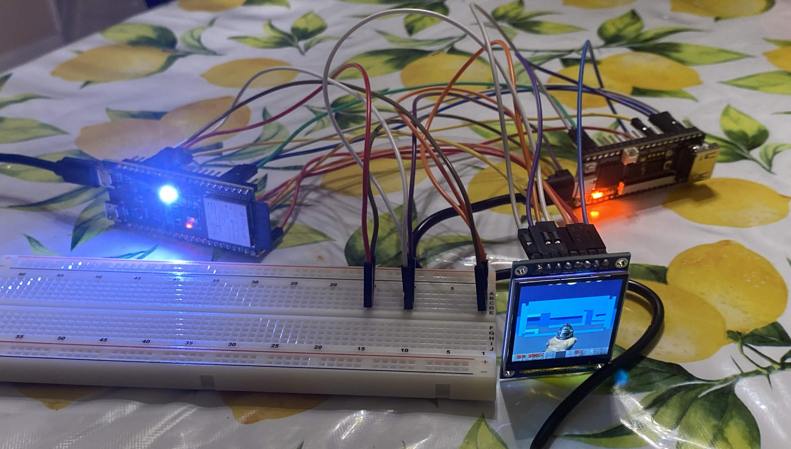
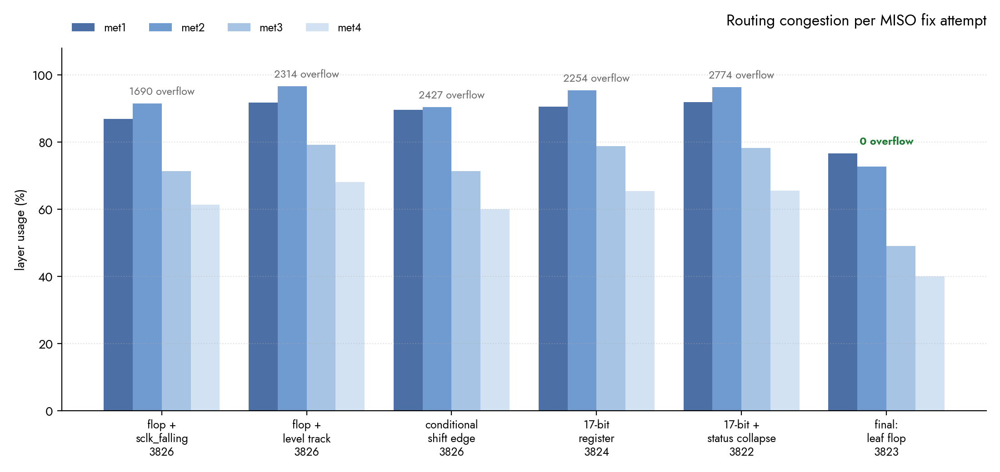

# Clementine Pre-Silicon Validation

- ALU, decoder, lanes, fetch sequencer, register file, SPI slave, multiplier, and mask stack end-to-end validated using a ESP32-S3 Devboard and a Gowin GW2AR FPGA (Sipeed Tang Nano 20K GW2AR-LV18QN88C8/I7).
- Inside [the host folder](bringup/host), a custom combined assembler + loader and a 19-kernel test suite were used to validate the entire ISA, grouped into per-lane identity, datapath, divergence, reverse-highway forms, and edge case tests.

## Validation Setup Diagrams

### Kernel Validation

- The combined assembler + loader assembles a kernel and streams it to the ESP32 UART port one command per packet.

- The UART-to-SPI passthrough firmware on the ESP32 then unwraps each packet, drives the opcode onto Clementine's three command pins, and clocks the payload out over SPI.

- Clementine then loads each instruction word into its 8-slot buffer, runs the kernel across four lanes once the assembler tells it to start, and holds the results in its four accumulators. 

- The assembler polls until the chip reports it has halted, then requests each lane in turn, shifting that accumulator out on MISO for the ESP32 firmware to return as a UART reply packet.

### DOOM Demo

- The header generators bake the DOOM1.WAD into three headers, E1M1's BSP tree and per wall segment sector heights, a Q0.7 sine table, and the HUD as RGB565, which are then compiled into the sketch and flashed over the ESP32 UART Port. 

- The doom_driver handles visibility and marshalling. It walks the BSP tree front-to-back so nearer walls claim columns first, culls backfacing wall segments before spending a single SPI frame on them, then packs each wall's endpoints into int8 camera-relative coordinates and streams them over SPI as EXEC and BUFFER frames.

- Clementine takes those endpoints and does every multiply and divide that puts a wall on screen. It rotates two wall segments at once across its four lanes, dividing by multiplying with a reciprocal, projects each ceiling and floor to a screen row, then computes coverage for every wall edge with SIMT MAC instructions, working out how much of the boundary cell the wall actually covers.

- The driver reads those rows back over MISO and does the scan conversion, filling the cells between edges Clementine returned, then drives the panel by comparing the character grid against the previous frame and blitting only the runs that changed. 

- Those pixels leave as READ_ACC transactions on the same MISO line the ST7789 listens on, so every byte the panel receives is shifted out of Clementine's accumulator.

## Validation Setup image

## Breadboard Setup

### Wiring

Three shared-bus nodes, each one breadboard column with three wires:

| Node | Driver | Listeners |
|---|---|---|
| SCLK | ESP32 GPIO12 | Tang pin 73, LCD SCL |
| MISO | Tang pin 75 | ESP32 GPIO13, LCD SDA |
| MOSI | ESP32 GPIO11 | Tang pin 74 |

Point-to-point:

| Signal | ESP32 | Tang Nano 20K |
|---|---|---|
| CS_N | GPIO9 | pin 76 |
| CMD0 | GPIO4 | pin 86 |
| CMD1 | GPIO5 | pin 72 |
| CMD2 | GPIO6 | pin 71 |
| GND | G | GND |

| LCD | Connects to |
|---|---|
| CS | ESP32 GPIO38 |
| DC | ESP32 GPIO42 |
| RES | ESP32 GPIO41 |
| VCC | Tang 3V3 |
| BLK | Tang 3V3 |
| GND | Tang GND |

On-board, no wires: clk = Tang pin 4 (27 MHz oscillator, PLL'd to 40.5 MHz), rst_n = pin 88 (button S1), LEDs = pins 15-18.

This setup ALSO works for the assembler + kernel tests aswell.

## Issues found

- During Pre-Silicon Validation, a bug in the SPI module was found that the cocotb testbenches missed, MISO updated on the SCLK rising edge, the same one that master samples on. MISO was wired directly to the top bit of the shift register, with nothing in between. When the register shifted, MISO changed immediately, on the same clock edge the ESP32 was reading it. The master kept catching the next bit instead of the current one so every value came back doubled. 

    - To fix this, I first tried a dedicated miso_out flop that loaded the top of the selected read-back value at CS-fall and advanced on a new sclk_falling edge detector, which worked on the hardware pushed congestion from 61% to 81% with 1,690 overflow. 
    - Suspecting that the edge detector was the cost, I replaced it with a  simple check for whether the clock line was low, so the flop tracked the register the whole time SCLK was low and froze while it was high. Same cell count, but congestion got worse at 87% and 2314 overflow. 
    - I then tried removing the flop entirely with a combinational mux, which came in at 3,823 cells and routed, but failed on the hardware because after N shifts the bit the master needs has already left the register and no mux over it can recover a bit that no longer exists.
    - Next, I made the shift edge itself conditional so the MOSI captured stayed on the rising edge while reads shifted on the failing one, which worked on the hardware but still routed at 81% with 2427 overflow. I tried widening data_register to 17 bits so the extra position absorbed the master's late sample, which worked, and collapsing the redundant ~sequencer_done status bit brought it to exactly 3,822 cells, but the congestion was the worst out of any attempt at 86% and 2,774 overflow. 
    - The working solution was going back to the dedicated MISO flop updating on the falling edge, dropping its reset, keeping the redundant status bit deleted, and restoring the guard that stops the shift register moving during per-lane staging frames. It resulted in 3,823 cells, 63.89% congestion, and zero overflow.

For the DOOM issues, see [doomdev.md](demo/doom/doomdev.md).