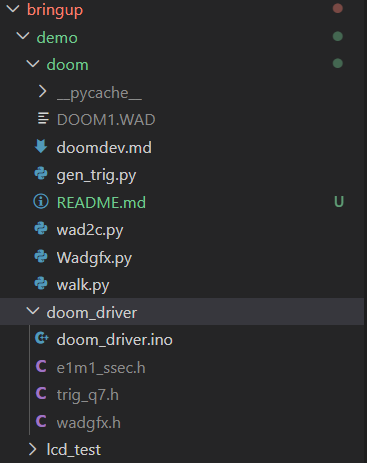

# Running the DOOM demo

## 1. Get the WAD

Download the shareware DOOM1.WAD from the [Internet Archive](https://archive.org/details/doom_20230531)
and drop it in this folder. It is not redistributed here.

## 2. Generate the headers

```bash
python3 wad2c.py DOOM1.WAD --map E1M1 --subsectors --nodes --heights -o e1m1_ssec.h
python3 gen_trig.py
python3 wadgfx.py DOOM1.WAD -o wadgfx.h
```

That gives you three headers: the BSP tree with per-wall sector heights, a Q0.7
sine table, and the pistol and status bar ripped from the WAD as RGB565.

## 3. Move them into the sketch

```bash
mv e1m1_ssec.h trig_q7.h wadgfx.h doom_driver/
```

Your setup should now look like this:



## 4. Flash the FPGA first

Program the Tang Nano 20K with the Clementine bitstream in Gowin Programmer.
This has to happen before the ESP32 runs, since the panel's data line is on
Clementine's MISO and nothing reaches the screen without it.

The bitstream is an SRAM load, so repeat this after any power cycle.

## 5. Flash the driver

Open `doom_driver/doom_driver.ino` in the Arduino IDE, select the ESP32-S3,
and upload.

## 6. Play

```bash
python3 walk.py
```

WASD to move, `q` to quit. If you are using WSL, you may need to attach the port first by using usbipd:

```powershell
usbipd list # find your MCU's BUSID
usbipd attach --wsl --busid <your-esp32-busid>
```

# Handheld build (128x160 ST7735)

The generator ships tuned for the 240x240 panel. For the handheld it needs
three additions in the ``wadgfx.py`` file, since that panel needs 4-pixel cells and a status bar whose
height scales differently from its width.

Add this next to `scale`:

```python
def scale_wh(img, wn, wd, hn, hd):
    h, w = len(img), len(img[0])
    nw, nh = w * wn // wd, h * hn // hd
    return [[img[y * hd // hn][x * wd // wn] for x in range(nw)] for y in range(nh)]
```

Add three arguments next to `--bar-den`:

```python
    ap.add_argument("--bar-h-num", type=int, default=None)
    ap.add_argument("--bar-h-den", type=int, default=None)
    ap.add_argument("--cell", type=int, default=8)
```

Replace the bar scaling line:

```python
        bhn = args.bar_h_num if args.bar_h_num else args.bar_num
        bhd = args.bar_h_den if args.bar_h_den else args.bar_den
        bar = scale_wh(bar, args.bar_num, args.bar_den, bhn, bhd)
```

And pass the cell size through:

```python
    gun = pad_to_cell(gun, key, args.cell)
    cls = classify(gun, key, args.cell)
```

Then:

    python3 wadgfx.py DOOM1.WAD --cell 4 \
        --bar-num 2 --bar-den 5 --bar-h-num 5 --bar-h-den 8 \
        --gun-num 1 --gun-den 1 -o wadgfx.h

Defaults are unchanged, so the 240x240 command still works either way.

Put the generated headers inside the ``doom_handheld`` folder along with the ``doom_handheld.ino`` file.