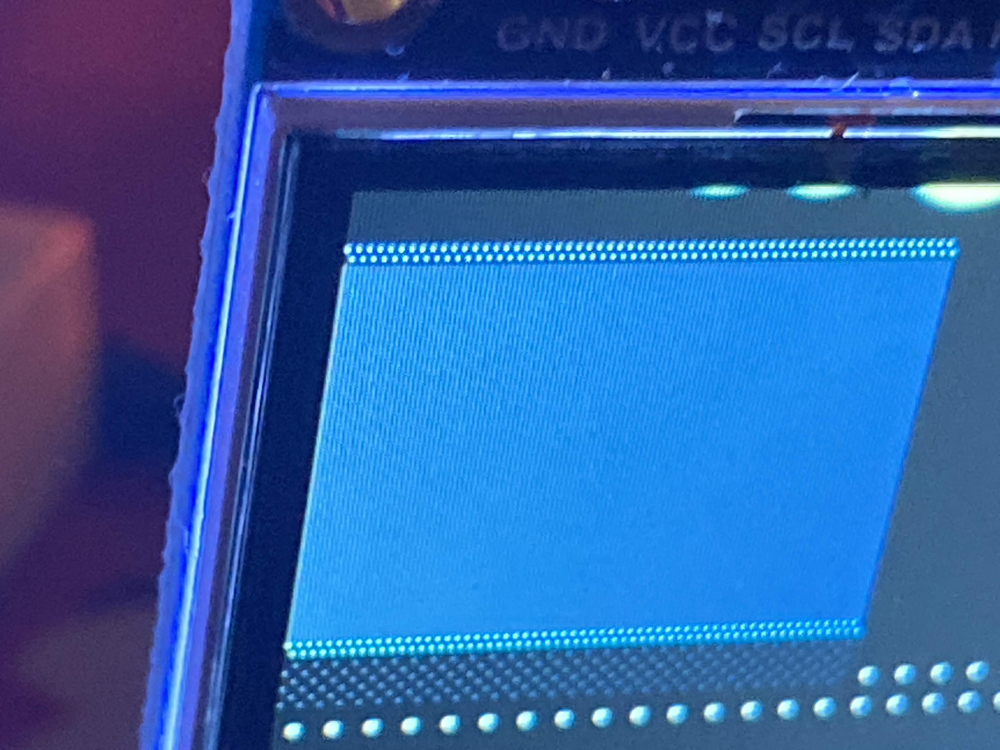
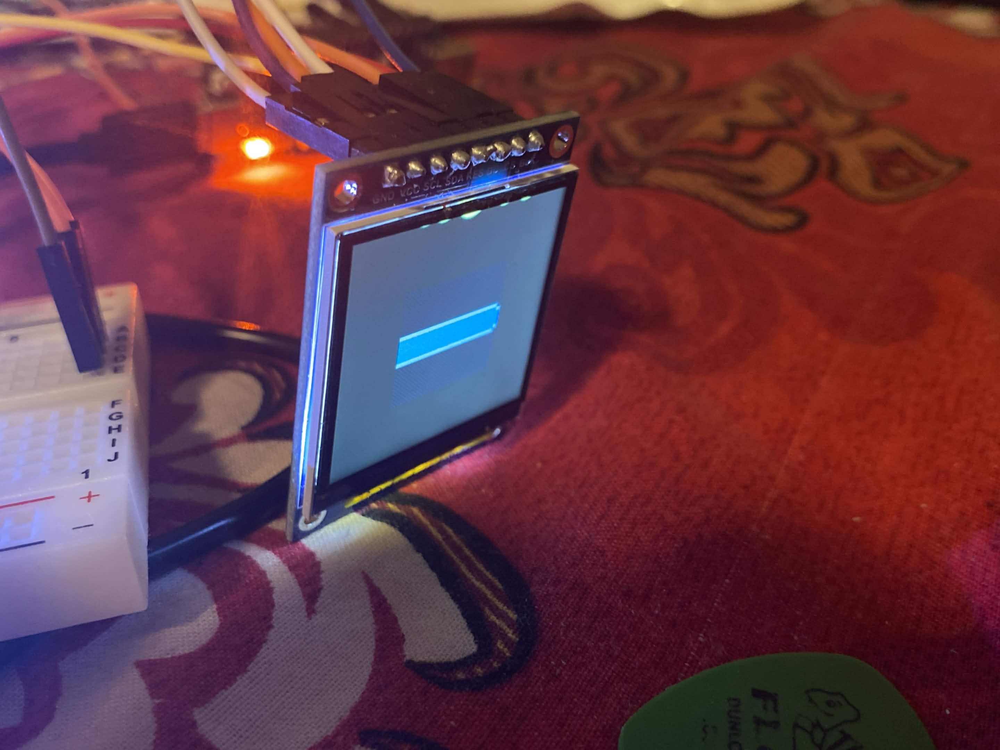
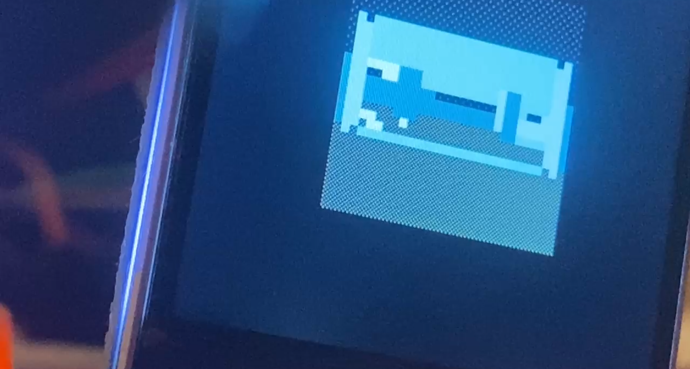
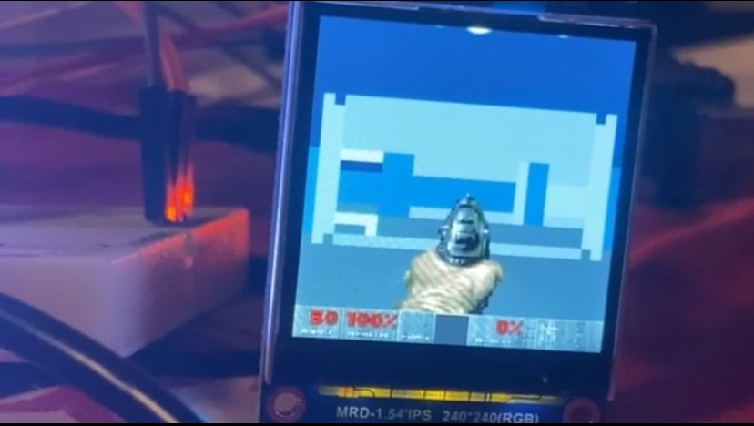

# DOOM DEVELOPMENT

## Trial 1

The first thing on the panel was a 120x120 view in the corner of the 240x240 display, running at 6 FPS. It rendered a single blue band across the width of view no matter where the camera was. Turns slid the bands sideways, and walking barely changed it. My BSP walk was correct, turning slid the band sideways, and the ASCII dump of the character grid showed SOME recognizable rooms. The reason why was a single wrong constant in my reciprocal divide helper. Since we have no divide instruction, the host shifts both operands into int8 range first then shifts the answer backward. That final shift was 6 + f - e - 4. However, I realized I derived it incorrectly. The numerator gets shifted down by e, the denominator by f, and the reciprocal is roughly 2^13/d8, so the product comes out scaled by 2^(13+f-e). Q4 output wants 2^4, so the shift should be 9 + f - e. The two differed by 7 bits, so every divide came back 128 times too large, across 20,000 random cases I made a test script for, the worst relative error was 12,903%. Essentially, 9 segments were drawable instead of the 96 segs that E1M1 should project. Fixing the derivation took the worst-case error from 12,903% to 34%, and turned the flat band into something adjacent to the E1M1 spawn point.

## Trial 2

The walls now landed in the right columns but came out as two rows tall, so the view was a thin horizonal band floating in an empty screen. This part is a significant jump, so I am going to (not so) briefly explain each error/change I did to make it recognizable.

- Depth was stored in a 16-bit field but could reach half a million. It comes out as fwd << (sh - K), and with sh running up to four bits above the base that lands around 500,000 against a 65,535 ceiling. Distant walls wrapped to arbitrary small values and picked a random height and glyph every frame, so widening the field to 32 bits stopped the flicker issue I was having.

- The camera's forward direction and my movement code disagreed by 90 degrees. The rotation was computed as fwd = `-x*s + y*c`, which makes the view direction (-s, c), while my  input handler moved the player along (c, s). So pressing W strafed sideways and the spawn faced west when the WAD says north. When I rewrote it as `fwd = x*c + y*s` and `side = x*s - y*c` it fixed the view direction and made the input handler correct without touching it.

- Walls crossing the eye plane had nothing stopping them. One endpoint ended up with fwd near zero, the perspective divide blows up, and that wall smeared across the whole screen, which is the Trial 1 symptom from a different cause. Adding a near plane at NEAR = 400 (near plane distance in depth units, 25 map units in front of the eye..) interpolated the offending endpoint onto it before projecting.

- Every wall in the map was the same height which was pretty much the real reason for the slivers. My segment header generated from my WAD parser carried wall endpoints and normals but no floor or ceiling data, so one global constant had to serve the whole map, and 18000 / 11176 gave a typical wall a half-height of exactly one row. E1M1 actually has 23 distinct room heights, from 56 to 296 units, so a constant tuned for one room is wrong by 5x in another. Getting those heights meant following three hops through the WAD. A wall segment only names a line and which side of it you're on, so you go segment to line to side to sector, taking the right sidedef when side == 0 and the left when side == 1, with a missing back side marking a solid wall. My existing line parser already read that lump but discarded those two fields, and widening its return tuple would have broken three other callers, so I wrote two new parsers for the SIDEDEFS and SECTORS lumps, which I had never needed until now, plus a third that re-reads LINEDEFS for only the two side indices my existing parser threw away. A final pass then walked through all 732 wall segments, resolves each one to the room in front of in the room in front of it and then the room behind it, as well as emitting four numbers per segment, the front ceiling, front door, back ceiling, and back door.

- One height per column had to become a ceiling and floor clip window per column. My old firmware stored a single wall height, which can only describe a solid wall, so anything with geometry visible or above or below it was unrepresentable. So I replaced that with a top and bottom bound per column that each wall narrows as the BSP walk passes through it, so a solid wall fills the window and seals the column, while a doorway fills only the gap where the ceiling steps down or the floor steps up and hands the narrowed window to whatever is behind it.

- Those clip windows were stored in 8-bit fields. Wall edges routinely project to rows past ±1000, which is WELL outside a screen that is only 30 rows tall, so the values wrapped. When I widened them to 16 bits and that was the last fix before I got to real E1M1.

## Trial 3

I apologize for the screenshot being iffy here, this was my "nightmare trial" so to say so I didnt take much photos since I was focused on performance. 

So at its current state, it was a 30x30 grid at 4 pixels, which is only a measly 120x120 as you can see. So I doubled the cell size to 8 and that same grid filled to 240x240, it surprisingly ran at 15.5 FPS and took 23.5 FPS to turn. Seeing how efficient it was, I decided to write a parser for DOOM's picture format to include the HUD. It's column based and run-length coded with an offset table per column, and converts the palette indices to RGB565. The status bar is 320 wide and at three quarters scale that is precisely 240, so the status bar fitted with no cropping which was great for me. It costed nothing per frame because once it's drawn at boot and marked reserved, with each cost of the pistol classified at build time as fully opaque, mixed or empty so the only 31 mixed cells (the gun pixels and see-through pixels that share a cell) composite over live geometry. 

For fun, I didn't want the ESP32 doing all of the rasterization, so I tried moving fragment generation onto Clementine too. The chip already computed the coverage, but the host still filled the spans between the edges it returned. Here's how far I got:

- I decided to read the low 4 bits of the value that clementine returned from the perspective divide (Q4 fixed-point number, bottom 4 bits are the fraction) instead of shifting them out, and use them to pick how full the edge cell is. My old firmware did >> 4 to throw them away and snap the wall edge to a whole cell. However, that fraction is how far into the cell the edge actually falls, which is coverage! I realized clementine had been giving me the answer every frame. So I picked a glyph filled to a quarter, half, three quarters, or full to match, which took every vertical edge resolution from 8 pixels to 2 and the walls stopped looking like stairs after every turn, looking like real solid walls. 

- Then I tried stepping the edges on the GPU too. Edges are linear in x, so walking one is an add, and MAC against a constant of 1 does it. Four lanes carried two columns of both edges, stepping two per instruction. 15.3 fps against 15.5 for the host, so free, but the edge drifted up to 1.2 cells, with 5.8% of cells differing including whole-cell flips between wall and floor.

- I realized the drift wasn't a bug I could tune out, The step has to fit in an int8 operand for MAC, so normalising it discards low bits, and stepping accumulates that loss once per column instead of cancelling it. The bound I derived worked out to `drift ≤ k * |dq|/64 = |t1-t0|/4`, so an edge travelling 20 cells drifts 5. Rounding instead of truncating halved it to 0.69 cells, still enough to flip a whole cell.

- A drift free version existed but was slower than the host. MVAC HI shifts the accumulator right by 8 into a register, which makes an exact 16-bit multiply possible with two extra MAC's. That's 19 SPI frames per 4 columns, times 331 columns a frame so 2,500 extra transactions against a host loop costing zero wire traffic, so 2,500 extra transactions against  a host loop costing zero wire traffic. So my bottleneck was that every GPU operation was a SPI round trip.

- So, coverage stayed on the chip and interpolation did not. Clementine does the camera transform, both perspective divides, the near clip, all four wall projections, and the edge coverage. The ESP32 fills between two rows the chip returned, scan conversion.

So, after that, it was still running at 8 FPS, which is expected since the chip was now computing coverage for every wall edge on top of everything else. To make it go from 8 FPS to 17 FPS (which surprised me because the methods I used were then the ESP32 doing the coverage), heres what did:

- So first, I decided to go at the display. The ceiling and floor were dithered and clementine reloaded its output register on every color change, so a checkerboard cell flipped color on every pixel and costed 107 SPI frames where a solid one costs 23.

- Second, I went after what cells I was sending to the panel. Walking makes a wall grow at both ends while the middle of it stays identical, and I was repainting every cell from the first changed row down to the last, dragging all that untouched wall along with it. So splitting each column into separate runs of changed cells dropped the pixels I pushed while walking from 33,560 to 11,260.

- Third, I went after the camera rotation, which was eating 23% of every frame. It was staging the same wall endpoints four times and reloading sine and cosine as immediates on every single call, even though the registers keep their values between kernel launches. I kept those constants loaded for the whole frame and left x and y sitting in their registers between passes, it took it from 38 SPI frames per wall down to 26, and pairing two walls per call filled all four lanes instead of just two.

- Fourth, I went after the perspective divide. The reciprocal was loaded with an immediate, which broadcasts one value to all four lanes and forces exactly one divide per call. I decided to stage it through the per-lane host buffer to make it it per-lane instead, so four divides with four different denominators run in one instruction stream. 16 SPI frames instead of 36.

Geometry went from 19,703 SPI transactions per frame down to 2,584.

## Final Result

